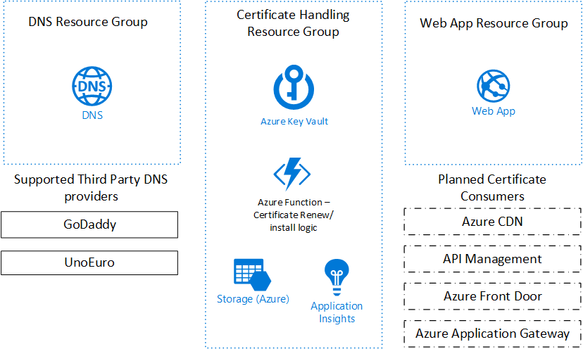

# Let's Encrypt Azure

The easiest and most robust method for deploying Let's Encrypt Wild Card Certificate to Azure Web Apps. 

# Getting Started
## Azure DNS + Azure Web  
Deployment template for setting up Let's Encrypt wild card certificate for Azure Web App (hosting plan and web app must be colocated in same resource group). Hostname must already be configured on the Web App and the DNS must be setup in Azure. 

# What is Let's Encrypt Azure

Let's Encrypt Azure is my second attempt to bring support for Let's Encrypt certificates on Azure. It is the spiritual successor to the Let's Encrypt Site-Extension, although they for the momemt support different usage scenarios. 

| Feature | Let's Encrypt Azure |	Let's Encrypt Site-Extension
|-----| ---- | ----
| Key Vault Support | X | Not supported
| Wild card SSL certificate support / DNS challenge | X | Not supported 
| Specific domain SSL certificate support / HTTP challenge| Planned | X 
| Managed Service Identity Authenticaiton | X | Not supported
| Azure Web Apps | X | X 
| Azure CDN | Planned | Not supported
| Azure Application Gateway | Planned | Not supported
| Azure Front Door | Planned | Not supported
| Web App behind Traffic Manager supported | X | X 

# How it works
Let's Encrypt Azure, works by deploying a resouce group with an Azure Function that runs code that talks to Let's Encrypt to request and renew the certificate, using the DNS challenge. Since DNS challenge is used the Function app needs access to the DNS provider used for the domain. All secrets required for the process are stored in Azure Key Vault. Once a certificate is generated it can be stored a various certificate storage locations and consumed by different certificate consumers. It used application insights for storing logs. 

## Certificate Storage
The recommend certificate storage location is Azure Key Vault, but is is possible to configure the Azure Function to store the certificate in Azure Blob Storage as well. 

## Certificate Consumers
Certificate consumers are the Azure Service that is going to consume the certificate. Right now the only supported consumer is Azure Web Apps, but more are planned for the future. 

* Azure Web Apps/Azure Functions
* Azure Front Door (not released)
* Azure Application Gateway (not released)
* Azure CDN (not released)

## DNS providers
DNS providers are where the DNS for the domain name is configured. Currently the following DNS providers are supported

* Azure DNS
* GoDaddy DNS
* UnoEuro DNS

